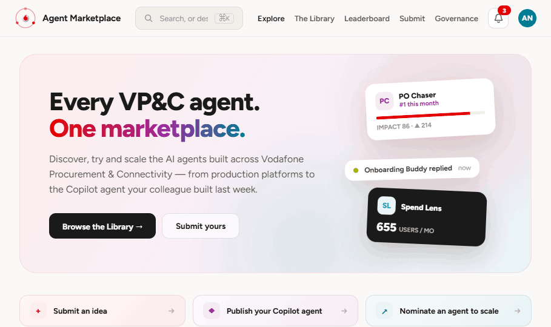

# Foundry - VP&C Agent Marketplace

A working pilot of the **Agent Marketplace** for Vodafone Procurement & Connectivity:
one place where anyone in VP&C can discover, try and scale the AI agents built across
the org - production platforms (Emplay, GCP, Looker) alongside the Copilot Studio agent
a colleague built last week.

Built from the interactive design spec in [`design/`](design/), which stays the source of
truth for layout, copy and flow.



---

## Run it locally

Needs **Python 3.11 or newer**. Verified end to end on 3.11 and on 3.14, which is what
the pilot deploys against.

```bash
python -m venv .venv && source .venv/bin/activate
pip install -r requirements.txt

cp .streamlit/secrets.toml.example .streamlit/secrets.toml   # then edit AUTH_PASS
streamlit run app.py
```

Open http://localhost:8501, sign in with the credentials you just set, and enter any
`@vodafone.com` address.

## Configuration

Every setting is read from Streamlit secrets first, then the environment - so
`.streamlit/secrets.toml` locally, Community Cloud secrets or plain env vars on a server.

| Key | Required | Default | What it does |
| --- | --- | --- | --- |
| `AUTH_USER` | yes | `vpc` | Shared reviewer username |
| `AUTH_PASS` | yes | - | Shared reviewer password. **Unset means nobody can sign in.** |
| `ALLOWED_EMAIL_DOMAIN` | no | `vodafone.com` | Domain the reviewer's email must match |
| `ALLOWED_EMAILS` | no | - | The people invited to use the app; mirror the Community Cloud viewer allowlist. Anyone not listed is turned away at sign-in. Unset opens the app to the whole domain. The older name `REVIEWER_EMAILS` is still honoured. |
| `ACCESS_CONTACT` | no | `Praveen` | Named in the "you're not authorised" message. |
| `SSO` | no | `false` | `true` once the host authenticates visitors. The app adopts that identity and the stage QR stops carrying a token. |
| `EVENT_SECRET` | no | - | Signing key for stage QR guest links. Unset means guest access is off. See *Guest access* below. |
| `GUEST_TOKEN_HOURS` | no | `4` | How long a scanned guest link stays valid. |

## Deploy

**Streamlit Community Cloud.** Create the app against this repo with `app.py` as the
entrypoint and `main` as the branch, then open *Advanced settings* and set two things
before deploying:

* **Python version - 3.14.** All of Streamlit's binary dependencies (pyarrow, numpy,
  pandas) publish `cp314` wheels, so nothing has to build from source.
* **Secrets** - paste the keys from the table above. Without `AUTH_PASS` the app
  deliberately refuses every login rather than falling back to a default.

Get the Python version right the first time: **it cannot be changed on a deployed app.**
Changing it means deleting the app and redeploying, which frees the subdomain for
immediate reuse but loses the secrets. A `runtime.txt` will not help - Community Cloud
reads the Advanced settings dropdown and ignores that file.

Once live, set the app to private under *Settings → Sharing* and invite reviewers by
email. Community Cloud apps are public by default, which would leave the shared password
as the only thing between the open internet and the pilot.

Two things to expect in normal running: pushing to `main` triggers an automatic
redeploy, and the container filesystem is ephemeral - votes, submissions and access
requests survive reruns and reconnects but reset when the app sleeps or redeploys.
That is fine for a pilot; see *Data* below for the durable path.

**Internal server** - anything that can run Python 3.11 or newer works:

```bash
pip install -r requirements.txt
export AUTH_USER=... AUTH_PASS=... ALLOWED_EMAILS=...
streamlit run app.py --server.port 8501 --server.address 0.0.0.0
```

Put it behind the standard reverse proxy for TLS. Here `data/` is a real disk, so
everything persists properly.

---

## What's in the pilot

| Page | What it does |
| --- | --- |
| **Explore** | Hero, three submission CTAs, monthly winner ticker, a "For you" row picked for the viewer's role, then three bands - Scaled & deployed, Copilot pilots, New ideas - each card carrying live-pulse and per-maturity metrics. |
| **The Library** | Full inventory. Maturity tabs, function and platform filters, one unified card. |
| **Agent detail** | About, how it works, sample prompts, owner, per-maturity metrics and reviews - plus a playground that adapts to the agent (below). |
| **Leaderboard** | The four scoring criteria, top-3 podium, full ranked table, past winners, and an expander that recomputes each score from its components. |
| **Submit** | Three tracks - idea, Copilot agent, scale nomination - with distinct fields, persisted on submit. |
| **Governance** | Open to everyone invited. Pending access-request queue with approve/deny, and the standing RBAC policy per agent. |

### The playground adapts to the platform

* **Copilot / GCP** - embeddable, so you get a live sandbox chat.
* **Emplay / Looker** - can't be framed, so you get a sample transcript and a deep link.
* **Restricted agents** - a lock panel naming the owner, and a request-access flow.
* **Ideas** - no agent exists yet, so an upvote panel instead.

Replies come from `CannedPlayground`, which replays the agent's scripted reply. Each real
platform has a typed adapter under `foundry/playgrounds/` whose `send()` documents exactly
what Phase 2 has to call.

### Concierge search

Type a task into the header search and press ↵. Matching is keyword overlap against each
agent's name, tagline, about text and function, and the "matches chase, overdue" line under
each hit is literally the words that matched - so a reviewer can see *why* something
surfaced. `foundry/concierge.py` marks the seam where Phase 3 swaps in an LLM call.

### Scoring

Scaled agents aren't scored - they're in production, so the marketplace shows adoption only.
Pilots are scored `0.4 × impact + 0.3 × adoption + 0.2 × satisfaction + 0.1 × community`,
each component normalised 0-100 across the cohort; the winner is promoted monthly. Ideas
carry upvotes only. One vote per reviewer per agent, keyed on the signed-in email.

`data/agents.json` stores the score the Evaluation Agent published for this cycle, which is
what the board shows. `foundry/scoring.py` is the reference implementation of the same
formula and drives the breakdown expander - ready to run against live telemetry in Phase 2.

---

## Layout

```
app.py                     st.navigation entrypoint + login gate
foundry/
  auth.py                  two-step pilot login, require_auth guard
  theme.py                 Vodafone palette, one global CSS block, light/dark
  components.py            top bar, Concierge panel, agent cards
  nav.py                   page registry and navigation helpers
  concierge.py             task → agent matching (LLM seam for Phase 3)
  scoring.py               the gamification rules
  repo.py                  AgentRepo protocol + JSONFileRepo
  datastores/              gcp · sap · datasphere · azure_pg (Phase 2 stubs)
  playgrounds/             copilot · emplay · gcp · looker (Phase 2 stubs)
  pages/                   explore · library · agent · leaderboard · submit · governance
data/                      agents.json + requests / submissions / votes / logins
design/                    the HTML spec, screenshots and logo - do not edit
```

## Guest access for a live audience

Putting a QR on a screen and asking a few hundred people to vote does not work
if the scan lands on a sign-in form. So while `SSO` is `false`, the stage QR
carries a short-lived signed token and scanning it goes straight into the
marketplace as a guest.

A guest can browse Explore, the Library and the Leaderboard, and vote. Submit,
Governance and access requests still require an ordinary sign-in, because those
put a colleague's name against a record. The app says plainly that you are a
guest and offers a way to sign in properly.

The token is `<expiry>.<hmac>` signed with `EVENT_SECRET`. Nothing is stored, so
it survives a restart and needs no database, and it expires on its own. Without
`EVENT_SECRET` the mechanism is off.

It is a bearer credential in a URL, and anyone in the room can photograph the
screen. That is an accepted trade for an internal event with illustrative data,
not a way to secure the app. Change `EVENT_SECRET` after the event to kill every
link handed out on the day.

**When SSO arrives**, set `SSO = "true"`. The app then adopts the identity the
host has established, guest tokens stop being accepted, and the QR carries no
token. `_sso_sign_in` in `foundry/auth.py` is the single place to adapt if AI
Booster passes identity in a proxy header rather than through Streamlit's OIDC
support.

## Data

`data/agents.json` is the seed inventory: 11 agents, matching the design spec exactly.
The other files start empty (`requests.json` ships with four seeded pending requests so
the Governance queue has something to work with) and are written at runtime:

* `votes.json` - one row per reviewer per agent
* `requests.json` - access requests and their approve/deny decisions
* `submissions.json` - everything filed through Submit
* `logins.csv` - one row per sign-in, for pilot adoption stats (gitignored)

All writes go through `JSONFileRepo`, behind the `AgentRepo` protocol. Swapping to a real
store is a one-line change in `foundry/repo.py:get_repo()` - the adapters in
`foundry/datastores/` already declare the full interface with per-method notes on what the
integration needs to do.

To reset a pilot back to its starting state: `git checkout data/` and delete `data/logins.csv`.

---

## Known limits of the pilot

These are deliberate, and each has a named owner in the next phase:

* **Authentication is one shared credential**, and the email is self-declared - the domain
  check is the only gate. Phase 2 replaces the whole of `foundry/auth.py` with Entra ID SSO,
  at which point entitlements come from the token rather than the `locked` flag.
* **Restricted agents stay restricted for everyone.** Approving a request in Governance
  records the decision and shows it in the queue; it does not grant access, because with a
  shared login there is no identity to grant it to. That lands with SSO.
* **No real agent is called.** Every playground reply is the agent's scripted line.
* **Storage is flat files.** Fine for one instance and a pilot-sized cohort; see *Deploy*
  for the caveat on Community Cloud.
* **Notifications, "Message" on the owner card and the platform deep links** are UI
  placeholders - they have no backend yet.
